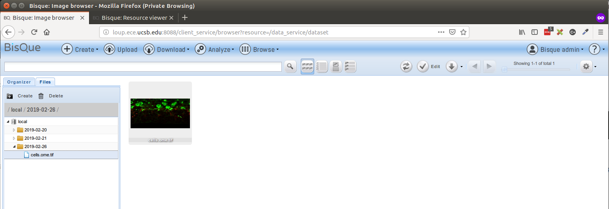
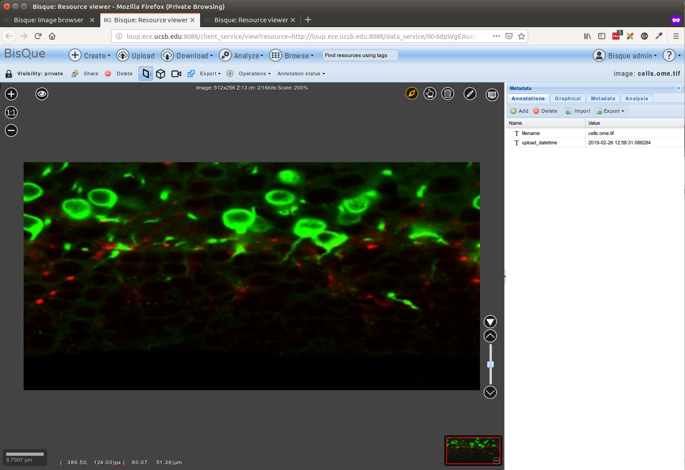
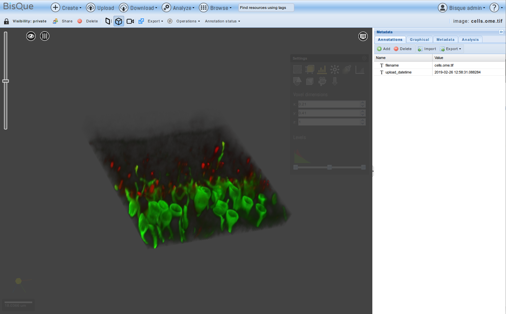

## [Bisque Development Environment Setup Instructions](https://biodev.ece.ucsb.edu/projects/bisquik/wiki/InstallationInstructions05)

This guide details the installation of a bisque server on an Ubuntu 16.04 LTS environment.

Project Source

- Github: https://github.com/UCSB-VRL/bisque

Developer Installation

- Bisque Github Pages: https://ucsb-vrl.github.io/bisque-dev/guides/bisque

Reference

- [Bique Bioimage Google Groups](https://groups.google.com/forum/#!topic/bisque-bioimage/jwo_5sHFeHU)
- [Instructions on installing bisque using docker](https://bitbucket.org/CBIucsb/bisque/src/default/README.md)

#### Setup for Ubuntu 16.04 
---
#### Pre-requisites 
```
sudo apt-get install -y python python-dev python-virtualenv python-numpy python-scipy 
sudo apt-get install -y libxml2-dev libxslt1-dev libhdf5-dev
sudo apt-get install -y libmysqlclient-dev libpq-dev mercurial git cmake
sudo apt-get install -y postgresql postgresql-client libsqlite3-dev
sudo apt-get install -y python-paver python-setuptools
sudo apt-get install -y graphviz libgraphviz-dev pkg-config
sudo apt-get install -y openslide-tools  python-openslide
sudo apt-get install -y libfftw3-dev libbz2-dev libz-dev
sudo apt-get install -y liblcms2-dev libtiff-dev libpng-dev
sudo apt-get install -y libgdcm2.6 libopenslide-dev libopenslide0

```

Install Openjpeg
```
git clone https://github.com/uclouvain/openjpeg
cd openjpeg && mkdir build && cd build
cmake .. -DCMAKE_BUILD_TYPE=Release
sudo make -j4 install
sudo ldconfig
```

Install BioImageConvert

- [BioImageConvert Source Repository](https://biodev.ece.ucsb.edu/projects/imgcnv)
- [Prebuilt Binaries Repository](https://bitbucket.org/dimin/bioimageconvert/downloads/)
- Setup for pre-built binaries (below)

```
# Ubuntu 18 version
wget https://bitbucket.org/dimin/bioimageconvert/downloads/imgcnv_ubuntu18_2.5.0.tar.gz

# Ubuntu 16 version
wget https://bitbucket.org/dimin/bioimageconvert/downloads/imgcnv_ubuntu16_2.4.3.tar.gz
tar -xvzf imgcnv_ubuntu16_2.4.3.tar.gz

sudo cp imgcnv_ubuntu16_2.4.3/imgcnv /usr/local/bin/
sudo cp imgcnv_ubuntu16_2.4.3/libimgcnv.so.2.4.3 /usr/local/lib/
sudo ln -s /usr/local/lib/libimgcnv.so.2.4.3 /usr/local/lib/libimgcnv.so.2.4
sudo ln -s /usr/local/lib/libimgcnv.so.2.4 /usr/local/lib/libimgcnv.so.2
sudo ln -s /usr/local/lib/libimgcnv.so.2 /usr/local/lib/libimgcnv.so
sudo ldconfig
```

Alternately, Compile by source and Install (You are on your own here)

```
hg clone --insecure http://biodev.ece.ucsb.edu/hg/imgcnv
cd imgcnv && make -j6 
sudo make install
```

---

#### A. Clone the repository and Prepare Virtual Environment

We will clone the stable repository and work inside a python virtual environment for setup requirements.

```
git clone https://github.com/UCSB-VRL/bisque.git bisque-stable
```
- Its always a good practive to use a virtualenv to develop projects

```
sudo pip install virtualenvwrapper
```
- Edit ~/.bashrc and export the following variables
  - In case of issues around virtualenvwrapper make sure the paths in the variables below exist

```
# virtualenv and virtualenvwrapper
export PATH=/usr/local/bin:$PATH
export VIRTUALENVWRAPPER_PYTHON=/usr/bin/python
export VIRTUALENVWRAPPER_VIRTUALENV=/usr/local/bin/virtualenv
source /usr/local/bin/virtualenvwrapper.sh
```

- Now load this using "source ~/.bashrc"
- Create a virtual envrionment "mkvirtualenv -p /usr/bin/python2 bqdev"
- Change environment "workon bqdev"

###### Deprecated Bootstrap Installer (Do Not Use this Script)

```
$ mkdir bisque && cd bisque
$ wget http://biodev.ece.ucsb.edu/projects/bisquik/export/tip/bisque-stable/contrib/bootstrap/bisque-bootstrap.py
$ python bisque-bootstrap.py bqenv

# Activate Virtualenv
bisque$ source bqenv/bin/activate
```

- Now Install requirements

```
pip install -i https://biodev.ece.ucsb.edu/py/bisque/xenial/+simple/ -r requirements.txt

Alternate Index Url for Development: https://biodev.ece.ucsb.edu/py/bisque/dev/+simple
Index Url Debian Stretch: https://biodev.ece.ucsb.edu/py/bisque/stretch/+simple/
Index Url Ubuntu xenial: https://biodev.ece.ucsb.edu/py/bisque/xenial/+simple/
```

- Fix the requirements.txt (Only if the installation fails)

```
#Fix the requirements.txt file using sed -i 's/.*psycopg2==2.6.1.*/psycopg2==2.7.1./' requirements.txt
psycopg2==2.7.1
Minimatic==1.0
Paste==1.7.5.1
httplib2==0.7.3
#tgext.registration==0.1dev

# Install separately since packages may be deprecated in PyPi
easy_install http://biodev.ece.ucsb.edu/binaries/depot/tgext.registration2/tgext.registration2-0.5.2.tar.gz

```

---

#### B. Configure Bisque Environment

- Run the Paver setup

```
$ paver setup
```

- Expected paver log tail

```
Installing collected packages: bqengine
  Running setup.py develop for bqengine
Successfully installed bqengine

Now run:
bq-admin setup 
```

- Run the bq-admin standalone setup 

```
$ bq-admin setup
```

- Expected bq-admin setup log tail (also observe the various inputs in the log for this setup)
 
```
  (bqdev) rahul@loup:~/repository/github/bisque$ bq-admin setup 
  INFO:root:Generating grammar tables from /usr/lib/python2.7/lib2to3/Grammar.txt
  INFO:root:Generating grammar tables from /usr/lib/python2.7/lib2to3/PatternGrammar.txt
  Developer installation
  DIRS:  {'bin': '/home/rahul/.virtualenvs/bqdev/bin', 'run': '.', 'share': '.', 'plugins': './plugins', 'packages': '/home/rahul/.virtualenvs/bqdev/lib/python2.7/site-packages', 'data': './data', 'virtualenv': '/home/rahul/.virtualenvs/bqdev', 'default': './config-defaults', 'jslocation': 'bqcore', 'modules': './modules', 'depot': './external', 'config': './config', 'public': './public'}
  INFO:root:Generating grammar tables from /usr/lib/python2.7/lib2to3/Grammar.txt
  INFO:root:Generating grammar tables from /usr/lib/python2.7/lib2to3/PatternGrammar.txt
  Developer installation
  DIRS:  {'bin': '/home/rahul/.virtualenvs/bqdev/bin', 'run': '.', 'share': '.', 'plugins': './plugins', 'packages': '/home/rahul/.virtualenvs/bqdev/lib/python2.7/site-packages', 'data': './data', 'virtualenv': '/home/rahul/.virtualenvs/bqdev', 'default': './config-defaults', 'jslocation': 'bqcore', 'modules': './modules', 'depot': './external', 'config': './config', 'public': './public'}
  This is the main installer for Bisque

      The system will initialize and be ready for use after a succesfull
      setup has completed.

      Several questions must be answered to complete the install.  Each
      question is presented with default in brackets [].  Pressing
      <enter> means that you are accepting the default value. You may
      request more information by responding with single '?' and then <enter>.

      For example:
      What is postal abbreviation of Alaska [AK]?

      The default answer is AK and is chosen by simply entering <enter>

      
  Beginning install of ['bisque', 'engine'] with ['server'] 
  CALLING  <function install_external_binaries at 0x7f9533ffac08>
  Fetch external binary files from Bisque development server [Y]? Y
  Matched section Linux-64bit-*
  extjs.zip found locally
  bioformats-pack.zip found locally
  libmbgl-linux-64-large.a found locally
  feature_extractors.zip found locally
  ImarisConvert.tar.gz found locally
  opencv-2.4.6.zip found locally
  CALLING  <function install_dependencies at 0x7f9533ffad70>
  2.4.3

  Found imgcnv version 2.4.3


  Imgcnv is installed and no-precompiled version exists. Using installed version
  ImarisConvert is up to date
  No pre-compiled version of openslide exists for your system
  Please visit our mailing list https://groups.google.com/forum/#!forum/bisque-bioimage for help
  Bioformats is up to date
  CALLING  <function install_features at 0x7f9533ffb050>
  Install feature extractors (Feature Server) [Y]? 
  Unpacking ./external/feature_extractors.zip into ./bqfeature/bq
  Install source code for feature extractors [N]? 
  To enable the feature service to read OME-bigtiff for feature extraction install
          libtiff4
          For Debian use the command apt-get install libtiff5-dev
          
  Install OpenCV-2.4.6 [Y]? 
  Extracted opencv-2.4.6/python2.7/cv.py -> /home/rahul/.virtualenvs/bqdev/lib/python2.7/site-packages/cv.py
  Extracted opencv-2.4.6/python2.7/cv2.so -> /home/rahul/.virtualenvs/bqdev/lib/python2.7/site-packages/cv2.so
  CALLING  <function install_plugins at 0x7f9533ff9b18>
  Try to install plugins [Y]? 
  INFO 'svn'not found: cannot fetch source repositories with svn 
  INSTALL PLGINS  ['./plugins']
  Checking ./plugins for modules
  CALLING  <function install_public_static at 0x7f9533ffa848>
  Deploy all static resources to public directory [Y]? 
  Creating ./public
  INFO:bq.image_service.server:Available converters: openslide (1.1.1), imgcnv (2.4.3), ImarisConvert (8.0.2), bioformats (5.1.1)
  Problem loading registration = bq.registration.controllers.registration_service: 'User'

  Generating packaged JS and CSS files

  INFO:minimatic:Combined -> ./public/core/css/all_css.css:
  INFO:minimatic:Combined -> ./public/core/js/all_js.js:
  CALLING  <function install_server_defaults at 0x7f9533ffa410>
  Server config
  Top level site variables are:
    bisque.admin_email=YourEmail@YourOrganization
    bisque.admin_id=admin
    bisque.organization=Your Organization
    bisque.paths.root=.
    bisque.server=http://0.0.0.0:8088
    bisque.title=Image Repository
  Change a site variable [N]? Y
  Enter the root URL of the server  [http://0.0.0.0:8088]? http://loup.ece.ucsb.edu:8080
  Your real name  administrator account []? 
  A login ID for the administrator account [admin]? 
  An email for the administrator [YourEmail@YourOrganization]? 
  A small organization title for the main page [Your Organization]? 
  The main title for the web page header [Image Repository]? 
  Installation Directory [.]? 
  Do you want to create new server configuations [Y]? 
  {'backend': 'paster',
  'e1.bisque.has_database': 'false',
  'e1.bisque.static_files': 'false',
  'e1.services_enabled': 'engine_service',
  'e1.url': 'http://0.0.0.0:27000',
  'h1.bisque.static_files': 'true',
  'h1.services_disabled': '',
  'h1.services_enabled': '',
  'h1.url': 'http://0.0.0.0:8088',
  'servers': 'h1'}
  The server agent for bisque [paster]? 
  list of server entries to be configured [h1]? 
  Install (update) paster configs (application server and configs) [Y]? 
  PARAMS {'h1.bisque.static_files': 'true', 'h1.services_enabled': '', 'e1.bisque.has_database': 'false', 'h1.url': 'http://0.0.0.0:8088', 'servers': 'h1', 'h1.services_disabled': '', 'e1.url': 'http://0.0.0.0:27000', 'e1.bisque.static_files': 'false', 'e1.services_enabled': 'engine_service', 'backend': 'paster'}
  h1: the url of the server [http://0.0.0.0:8088]? http://loup.ece.ucsb.edu:8080
  h1: Services enabled []? 
  h1: Services disabled []? 
  Created paster config:  ./config/h1_paster.cfg
  CALLING  <function install_mail at 0x7f9533ffa758>
  Enable mail delivery [Y]? N
  CALLING  <function install_secrets at 0x7f9533ffa8c0>
  Encrypt cookies with secret phrase [CEMWOJ65]? 
  CALLING  <function install_database at 0x7f9533ff9578>
  A database URI [sqlite:///data/bisque.db]? 
  Trying to import driver sqlite3...
  Driver successfully imported.
  Create and initialize database [Y]? 
  A database URI [sqlite:///data/bisque.db]? 
  Checking whether database "data/bisque.db" already exists...
  Yes, it exists.
  Upgrading database version (alembic)
  INFO  [alembic.migration] Context impl SQLiteImpl.
  INFO  [alembic.migration] Will assume non-transactional DDL.
  CALLING  <function install_preferences at 0x7f9533ffa7d0>
  Initialize Preferences  [Y]? 
  Force initialization  [N]? 
  INFO:bq.config:DATABASE sqlite:///data/bisque.db
  INFO:bq.config:SQLLite special handling NullPool timoout
  INFO:bq.image_service.server:Available converters: openslide (1.1.1), imgcnv (2.4.3), ImarisConvert (8.0.2), bioformats (5.1.1)
  INFO:bq.blobs.mounts:Loaded drivers OrderedDict([('local', {'top': 'file://$datadir/imagedir/', 'mounturl': 'file://$datadir/imagedir/$user/'})])
  WARNING:bq.blobs.mounts:SQLITE does not support subtransactions: some mount service operations will fail
  INFO:bq.blobs.plugins:Resource plugins: ['(bisque_pipeline, bq)', '(cellprofiler_pipeline, cppipe)', '(cellprofiler_pipeline, cp)', '(dream3d_pipeline, json)', '(imagej_pipeline, ijm)', '(text, asc)', '(text, ascii)', '(text, zw)', '(text, hz)', '(text, txt)', '(text, utxt)', '(text, utf8)', '(table, csv)', '(table, hdf)', '(table, hdf5)', '(table, h5)', '(table, he5)', '(table, h5ebsd)', '(table, dream3d)', '(table, csv)', '(table, xls)', '(table, xlsx)']
  WARNING:bq.service:Following service were not found: set(['mnt'])
  /home/rahul/.virtualenvs/bqdev/local/lib/python2.7/site-packages/sqlalchemy/sql/sqltypes.py:226: SAWarning: Unicode type received non-unicode bind param value 'system'. (this warning may be suppressed after 10 occurrences)
    (util.ellipses_string(value),))
  NO ACTION: System object initialized at <system created="2019-02-04T10:51:57.823907" name="system" owner="http://localhost/data_service/00-2jimYQLLjB3yy3HuTwQM5c" permission="published" resource_uniq="00-UAZfWJYjDKp4yhabV3PP7S" ts="2019-02-04T10:51:57.823907" uri="http://localhost/data_service/00-UAZfWJYjDKp4yhabV3PP7S"/> 
  Problem initializing preferences.. please use bq-admin preferences

  Initialize your database with:
    $ bq-admin setup createdb

  You can start bisque with:
    $ bq-admin server start
  then point your browser to:
      http://loup.ece.ucsb.edu:8080
  If you need to shutdown the servers, then use:
    $ bq-admin server stop
  You can login as admin and change the default password.

  Send Installation/Registration report [Y]? N
  (bqdev) rahul@loup:~/repository/github/bisque$ 


```

- Add "config/runtime-bisque.cfg" for module configuration and docker image registry
  - Edit and add run config from config-defaults/runtime-bisque.defaults to config/runtime-bisque.cfg
  - Here are some local changes but requires docker to be setup

```
runtime.platforms = command
runtime.staging_base = staging/

[docker]
docker.enabled = true
# A  hub where to push containers to
docker.hub = biodev.ece.ucsb.edu:5000
```

---

#### C. Run Bisque Server

- Start/Stop the server

  ```
  $ bq-admin server start
  $ bq-admin server stop
  ```

- Overview of Installation (Just for review)

  ```
  workon bqdev
  paver setup    [server|engine]
  bq-admin setup [server|engine]
  bq-admin deploy public
  ```

Open in browser


#### D. Upload Dataset 
- Upload an [image file](img/cells.ome.tif) from your local directory to Bisque 
  

- Browse uploaded dataset in the file explorer
    - Select Browse menu item in the navigation bar and click on dataset
    - Thereafter click on the files tab and click through the local database folder in the left document tree section.

  

- Select the uploaded file to view 
    - This visualization is by default 2D in nature. 
    - The various slices can be stepped through or played using the scroll bar on righ bottom of the image view area

  

  - A 3D visualization can be explored by clicking the cube icon towards the right of share and delete icons on the tool bar right below the navigation bar.

  

---
#### E. Module 

##### Load/Install Module packages and dependencies

Lets take module/MetaData code as an example.

- Ensure ~/bisque/config/runtime-bisque.cfg has the configuration as below
```
runtime.staging_base = staging/
docker.hub = biodev.ece.ucsb.edu:5000
```
- Make sure the runtime-module.cfg is as per below
```
module_enabled = True
runtime.platforms=command
[command]
environments = Staged
executable = python MetaData.py
files = MetaData.py
```
- Now build/compile this module
```
 cd ~/bisque/modules/MetaData
 python setup.py
```

Open up the Bisque web interface at http://loup.ece.ucsb.edu:8088

- Login using admin:admin 
- Update the email address in the users context menu item (This is important)
- Open Module Manager from the admin user context menu
- Paste the following URL in the Module->Engine Module
```
http://loup.ece.ucsb.edu:8088/engine_service/
```
- List of engine modules could be seen
- Drag-n-Drop say MetaData module from the list to the left window and close the window

  
  

##### Run Module

- Refresh the page, go to Analyse and select Metadata module there
  

- Select a single image for test
  

- Execute Run command and observe the updates in the results section
  

#### F. Debug Module
- Every module run will generate a model execution identifier to track this execution. You can observe this after clicking the run command and you have a result. It could be success or fail in the Results section

```
http://loup.ece.ucsb.edu:8088/module_service/MetaData/?wpublic=1#mex=http://loup.ece.ucsb.edu:8088/module_service/mex/00-ZmuAoE43wTxByycmaCnvBF
```

- The mex identifier (==MEX_ID=00-ZmuAoE43wTxByycmaCnvBF==) observed from URL can be used to locate this execution code & resulting logs in the staging folders
- change directory to this staging folder and observe the files there

```
cd ~/bisque/staging/00-ZmuAoE43wTxByycmaCnvBF
rahul@loup:~/bisque/staging/00-ZmuAoE43wTxByycmaCnvBF$ tree 
.
├── MetaData.log
├── MetaData.py
├── python.log
└── state00-ZmuAoE43wTxByycmaCnvBF.bq
0 directories, 4 files
```

- Here we can see that the MetaData.log and python.log files are generated
- In case of issues these are the log files that we need to look into for detailed error reporting
- main log file is the bisque_8088.log file at the ~/bisque home directory 
  
```
13:45:11,996 INFO  [bq.root] [admin] POST http://loup.ece.ucsb.edu:8088/module_service/mex/00-ZmuAoE43wTxByycmaCnvBF?view=short
13:45:12,001 INFO  [bq.module_server] MEX APPEND http://loup.ece.ucsb.edu:8088/module_service/mex/00-ZmuAoE43wTxByycmaCnvBF?view=short
13:45:12,205 INFO  [bq.engine_service.command_run] SUCCESS Command python MetaData.py http://loup.ece.ucsb.edu:8088/data_service/00-6dpWgEAue2iz8YZcKPHejh http://loup.ece.ucsb.edu:8088/module_service/mex/00-ZmuAoE43wTxByycmaCnvBF admin:00-ZmuAoE43wTxByycmaCnvBF with 0
13:45:12,206 INFO  [bq.engine_service.command_run] All processes have returned ['finished']
13:45:12,206 INFO  [bq.engine_service.command_run] finishing 1 mexes -> [{'files': ['MetaData.py'], 'status': 'finished', 'executable': ['python', 'MetaData.py', 'http://loup.ece.ucsb.edu:8088/data_service/00-6dpWgEAue2iz8YZcKPHejh', 'http://loup.ece.ucsb.edu:8088/module_service/mex/00-ZmuAoE43wTxByycmaCnvBF', 'admin:00-ZmuAoE43wTxByycmaCnvBF'], 'initial_dir': '/home/rahul/repository/github/bisque-dev', 'module_enabled': 'True', 'named_args': {'bisque_token': 'admin:00-ZmuAoE43wTxByycmaCnvBF', 'image_url': 'http://loup.ece.ucsb.edu:8088/data_service/00-6dpWgEAue2iz8YZcKPHejh', 'mex_url': 'http://loup.ece.ucsb.edu:8088/module_service/mex/00-ZmuAoE43wTxByycmaCnvBF'}, 'bisque_token': u'admin:00-ZmuAoE43wTxByycmaCnvBF', 'environments': 'Staged', 'runtime.staging_base': 'staging/', 'mex_id': '00-ZmuAoE43wTxByycmaCnvBF', 'runtime.matlab_launcher': 'config-defaults/templates/matlab_launcher_SYS.tmpl', 'arguments': [], 'module_dir': '/home/rahul/repository/github/bisque-dev', 'staging_path': '/home/rahul/repository/github/bisque-dev/staging/00-ZmuAoE43wTxByycmaCnvBF', 'iterables': False, 'log_name': '/home/rahul/repository/github/bisque-dev/staging/00-ZmuAoE43wTxByycmaCnvBF/python.log', 'runtime.matlab_home': '', 'mex_url': 'http://loup.ece.ucsb.edu:8088/module_service/mex/00-ZmuAoE43wTxByycmaCnvBF', 'rundir': '/home/rahul/repository/github/bisque-dev/staging/00-ZmuAoE43wTxByycmaCnvBF', 'runtime.platforms': 'command'}]
```

- This will show us the COMMAND that was run to execute this module with MEX_URL

```
python MetaData.py \
http://loup.ece.ucsb.edu:8088/data_service/00-6dpWgEAue2iz8YZcKPHejh \ 
http://loup.ece.ucsb.edu:8088/module_service/mex/00-ZmuAoE43wTxByycmaCnvBF \
admin:00-ZmuAoE43wTxByycmaCnvBF
```
- This is the command that we can use to debug and rerun/replay this MEX in order to update the execution result. This is different from running the module again from the web interface since that will produce a new MEX_ID and create another staging folder corresponding to that.

#### G. Module MEX/UI
- Click on Browse->mex to go to the Model execution page

  

  

- Here we will be able to see the various MEX sessions that were run for all modules under execution
- We will be able to obtain the MEX_ID and view its state from here by selecting one of the executions of interest.

  

- In case we select a module that has errors in it then it would turn out to show the status with messages in red

  

- Now let us go to Browse->dataset and select the file that we ran the module for. Here we will be able to view the Annotation that was added by the Metadata module to this image.
    - Annotation can be visualized using the "Annotations" tab on the right
  
  

  - The Model execution runs can be seen in the "Analysis" tab on the right

  


---

#### Further 


#### Docker & Condor based modules require additional setup

> NEXT

- Install Docker (https://docs.docker.com/install/linux/docker-ce/ubuntu/)
  - Also go through the post-installation steps
  - Also install the [Nvidia-docker](https://github.com/nvidia/nvidia-docker/) in case you are planning to use GPU based modules or connoisseur services.
- Install Condor (https://research.cs.wisc.edu/htcondor/ubuntu/)
  - Understand the configurations as well for master & slave setup 
  - [Bisque Condor Setup Instructions](../rancher2_condor) 

  ```
  rahul@bqdev:~$ /etc/init.d/condor restart
  [ ok ] Restarting condor (via systemctl): condor.service.
  rahul@bqdev:~$ ps -ef | grep condor
  ```


