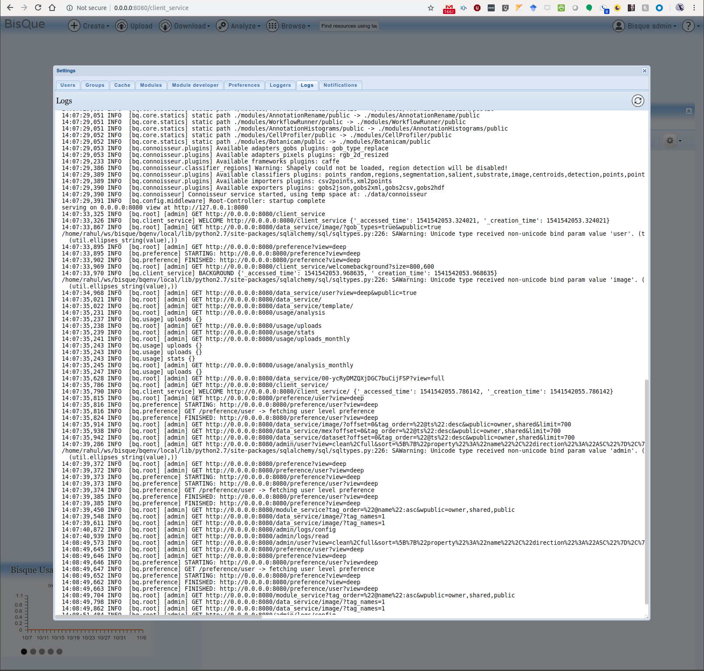
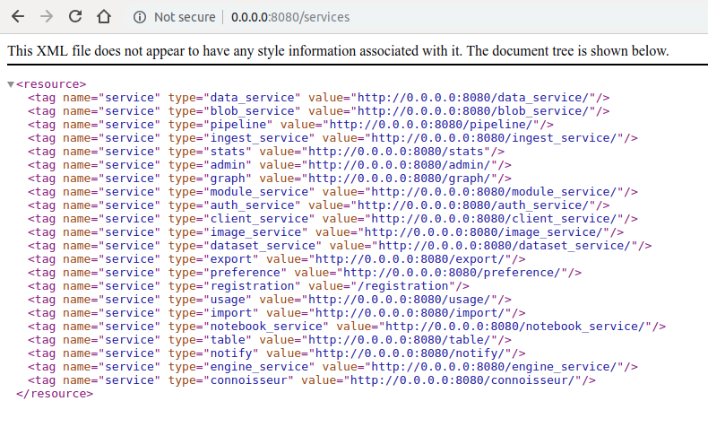
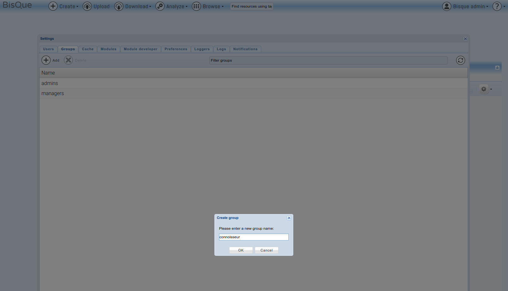
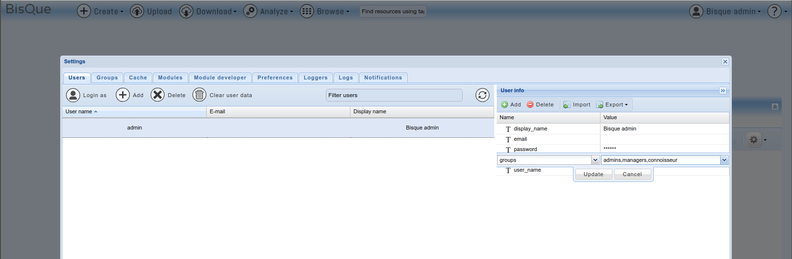
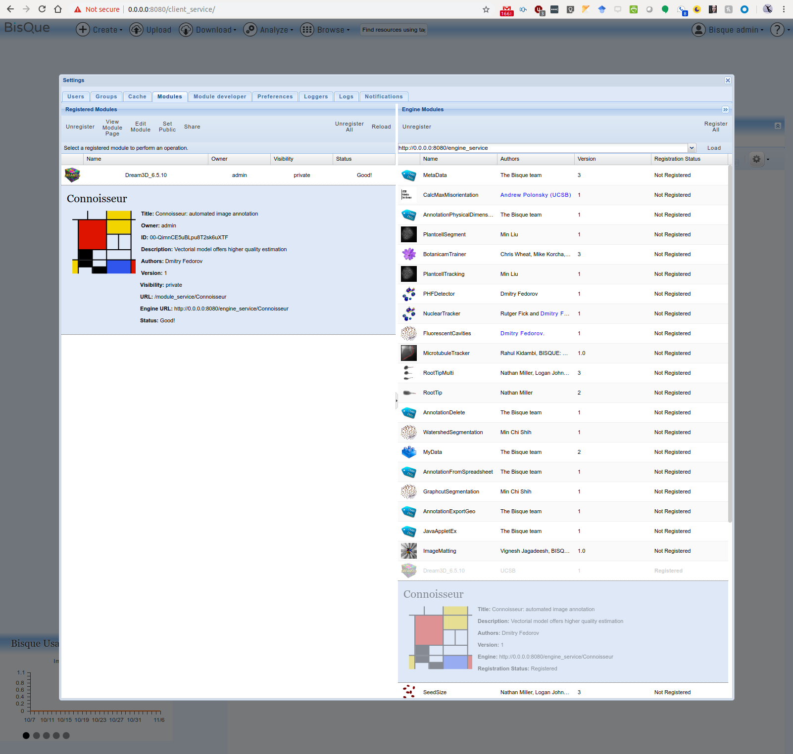
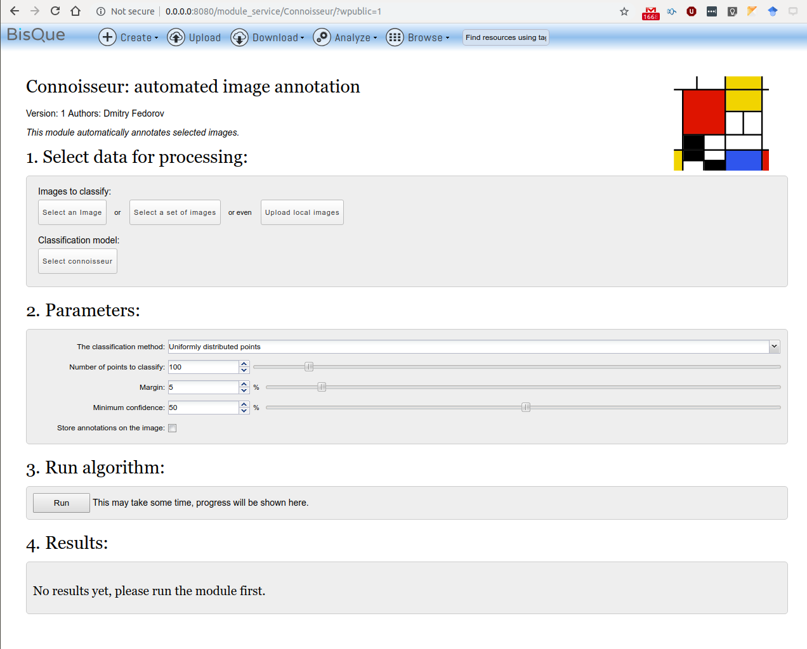

## Setup Connoisseur

### Information 

- Connoisseur is the DL module for distributed compute. 
- Condor is running on each node 

#### TODO

- Figure out the configurations !!!

### 1. OpenCV 3.4.1
   Installation Guide: [Link 1](https://rahulvishwakarma.wordpress.com/2018/07/12/compile-and-setup-opencv-3-4-x-on-ubuntu-18-04-lts-with-python-virtualenv-for-image-processing/)
```
# Verify your installation
pkg-config --libs opencv
```

### 2. [CUDA 8.0](https://developer.nvidia.com/cuda-downloads) and [cuDNN v7.1.4](https://developer.nvidia.com/rdp/cudnn-archive)
Installation Guide: [Link1](https://medium.com/@zhanwenchen/install-cuda-and-cudnn-for-tensorflow-gpu-on-ubuntu-79306e4ac04e), [Link2](https://rahulvishwakarma.wordpress.com/2018/07/13/tensorflow-gpu-setup-with-cudnn-and-nvidia-cuda-9-0-on-ubuntu-18-04-lts/)

- [Download cuda_8.0.61](https://developer.nvidia.com/compute/cuda/8.0/Prod2/local_installers/cuda_8.0.61_375.26_linux-run)
```
  $ nvcc --version
  nvcc: NVIDIA (R) Cuda compiler driver
  Copyright (c) 2005-2016 NVIDIA Corporation
  Built on Sun_Sep__4_22:14:01_CDT_2016
  Cuda compilation tools, release 8.0, V8.0.44
```
- [Download libcudnn7-dev_7.1.4](https://developer.nvidia.com/compute/machine-learning/cudnn/secure/v7.1.4/prod/8.0_20180516/Ubuntu16_04-x64/libcudnn7-dev_7.1.4.18-1_cuda8.0_amd64)
```
  cuDNN v7.1.4 Runtime Library for Ubuntu16.04 (Deb)
  cuDNN v7.1.4 Developer Library for Ubuntu16.04 (Deb)
```

### 3. [CAFFE](http://caffe.berkeleyvision.org/)
Setup caffe 1.0 using the [official guide](https://github.com/BVLC/caffe/wiki/Ubuntu-16.04-or-15.10-Installation-Guide) 

- Installation Overview
```
  mkdir build 
  cd build 
  cmake .. 
  make all 
  make install 
  make runtest
```
```
  $ caffe --version
    caffe version 1.0.0
```

- Make sure you configure the path env in ~/.bashrc
```
  export PATH=$PATH:/usr/local/cuda/bin:~/cv/caffe/build/tools
  export LD_LIBRARY_PATH=$LD_LIBRARY_PATH:/usr/local/cuda/lib
  export LD_LIBRARY_PATH=$LD_LIBRARY_PATH:/usr/local/cuda/lib64
  export LD_LIBRARY_PATH=$LD_LIBRARY_PATH:/usr/local/cuda/extras/CUPTI/lib64

  export LD_LIBRARY_PATH=$LD_LIBRARY_PATH:~/cv/caffe/.build_release/lib
  export PYTHONPATH=$PYTHONPATH:~/cv/caffe/python/:~/cv/caffe/.build_release/lib
```

- Also add the following in ~/[python_env_folder]/bin/activate script after the PATH variable setup
```
  export PYTHONPATH=$PYTHONPATH:~/cv/caffe/python/
```

Test it all out to ensure caffe and opencv are functional
```
  (bqenv) rahul@bqdev:~/ws/bisque$ python 
  Python 2.7.12 (default, Dec  4 2017, 14:50:18) 
  [GCC 5.4.0 20160609] on linux2
  >>> import cv2
  >>> import caffe
  >>> 
```
Also, ensure Caffe runs on the system
```
  $ caffe --version
  caffe version 1.0.0
```

### 4. Install Connoisseur

Pre-requisite: (caffe and opencv may be the cause)
```
  source ~/bisque/bqenv/bin/activate
  pip install lmdb pyvoro
```

Installation

- In Bisque top directory unzip the contents of module/connoisseur.zip
- Activate Env 
  ```source ~/bisque/bqenv/bin/activate ```
- Ensure that caffe and opencv is importable in python
- Install connoisseur 
  ``` cd ~/bisque/connoisseur && pip install -e connoisseur ```
- Move the module to Bisque modules 
  ``` mv ~/bisque/connoisseur/modules/Connoisseur/ ~/bisque/modules/ ```
- Deactivate Env 
  ```source ~/bisque/bqenv/bin/deactivate```
- Re/Start the Bisque server
  ```
  $ paver setup && bq-admin setup
  $ bq-admin server start
  $ bq-admin server stop
  ```
- Make sure the service is available at http://0.0.0.0:8080/services
- Verify the log in module manager has no errors 
  
- Thereafter look for the loaded services at the URL http://0.0.0.0:8080/services
  
  Look for the service named connoisseur in this list

### 5. Load Connoisseur  
Now lets add the connoisseur user group for loading the module

1. Create a connoisseur group
  
2. Add this group to the user/admin
  
3. Restart the services
   ```$ bq-admin server start && bq-admin server stop ```
4. Load the module as user/admin 
   
5. Open the module from navbar using Analyze->Classification->Connoisseur 
   

TODO: Configuration, load model and run a test on Connoisseur