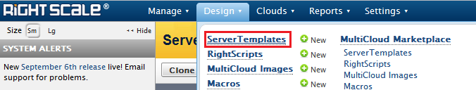
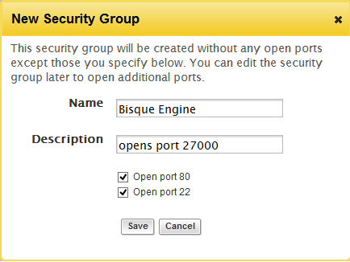

Bisque on the Cloud
===================
.. toctree::
   :maxdepth: 2

Overview
--------

It is possible to get a new Bisque instance up and running with minimal effort and technical know-how by using Amazon EC2 and Rightscale. This document guides you on how to setup a standalone bisque instance in the cloud and optionally configure a scalable condor grid for compute heavy instances.

Tutorials
---------

You need to Sign-up for `Amazon Web Services <http://aws.amazon.com>`_ and `Rightscale <https://www.rightscale.com>`_. 

- `Sign-up for Amazon Web Services <http://support.rightscale.com/03-Tutorials/01-RightScale/3._Upgrade_Your_Account/1.5_Sign-up_for_AWS>`_

- `Sign-up for a Free RightScale Account <http://support.rightscale.com/03-Tutorials/01-RightScale/1._Signing_Up_for_RightScale/Sign-up_for_a_Free_RightScale_Account>`_

- `Add AWS Credentials to RightScale <http://support.rightscale.com/03-Tutorials/01-RightScale/3._Upgrade_Your_Account/1.7_Add_AWS_Credentials_to_the_Dashboard>`_

Creating a Bisque Instance
--------------------------

- Logon to Rightscale and import the `Bisque Server Template <https://my.rightscale.com/library/server_templates/Bisque-Server-Template/lineage/15175>`_. This template will serve as the basis for launching and configuring a new bisque installation.

  Bisque Server Template

- Once imported, the template will be available in your server templates library. Select it and choose "Add Server". Also select the cloud region where you would like to host the new bisque installation. Typically a geographic region closest to where the installation would generally be accessed from would be best.

  Server templates library

  Select cloud region

  Add a new server

- Next, you will be presented with various options to customize the hardware and network details of your bisque installation. You may leave most options to default as shown with the exception of the security groups (1). It is very important to configure this option correctly otherwise, you may not be able to run any modules on the bisque instance.

  Server details

- In security groups, click on "new". You need to create a security group that allows all TCP traffic from any IP on port '27000'.

  Create a new security group

- Once created, select the cloud region of the bisque installation and click on EC2 security groups. Select the group you created and add a new permission allowing TCP traffic on port 27000.

  height: 280 pt
  :alt: Edit a security group

  Edit a new security group

  height: 100 pt
  :alt: Add permissions to a security group

  Add permissions to a security group

- For additional information regarding security groups - `How to create a security group using Rightscale <http://support.rightscale.com/12-Guides/Dashboard_Users_Guide/Clouds/AWS_Region/EC2_Security_Groups/Actions/Create_a_New_Security_Group>`_
- You may optionally edit the name of the server, the instance type (2) for a better machine (for a higher price) and also associate an elastic IP (3) i.e a static IP that can be used in case you wish to host your bisque instance with a more meaningful DNS name.
- Once configured, click launch. User inputs and Configuration options specific to the bisque system will be displayed next.

Configuring the Bisque Instance
-------------------------------

